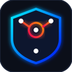
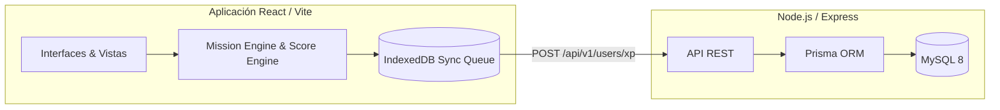

<div align="center">
  

  # CyberNexo Security Lab

  **Videojuego didáctico multiplataforma sobre ciberseguridad. Aprende a protegerte jugando en un entorno seguro ("Blue Team").**

  <p align="center">
    
    
    
    
    
    
    
  </p>

  [Características](#-características-principales) • 
  [Arquitectura](#-arquitectura) • 
  [Inicio Rápido](#-inicio-rápido) • 
  [Estructura](#-estructura-del-proyecto) • 
  [Pruebas](#-pruebas)

</div>

---

> **Aviso:** Este es un proyecto desarrollado íntegramente bajo la metodología *Spec-Driven Development (SDD)*. Toda la lógica matemática, de sincronización offline y progresión de niveles está descrita estrictamente en la documentación oficial (`/docs`).

## 🚀 Características Principales

- **🎮 Aprendizaje Basado en Decisiones:** Ciclo cognitivo estructurado (Observar ➔ Analizar ➔ Decidir ➔ Consecuencia). Incluye módulos de Phishing, Contraseñas, Privacidad y Navegación Segura.
- **🏆 Sistema de Progresión:** Gana XP, sube de rango (Recluta a Cyber Guardian), desbloquea logros y compite en el Salón de la Fama Global.
- **⚡ Desafío Diario:** Un reto de alta presión cronometrado de 3 minutos, sin pistas y con penalización crítica por fallo.
- **📶 Offline-First (Sync Queue):** Motor de base de datos en el navegador (`IndexedDB`) apoyado por PWA (Service Workers). Si el alumno pierde conexión a internet, su partida se encola y se sincroniza al recuperar la red de forma invisible.
- **💻 Ecosistema Multiplataforma:** Juega en Web, instálalo en el móvil como PWA, o córrelo nativamente en Windows/macOS vía Electron.js (con estricto `contextIsolation`).
- **🛡️ Panel de Administración (Overseer):** Estadísticas globales en tiempo real e interfaz CMS para la gestión de misiones en formato JSON.

---

## 🏛️ Arquitectura

El sistema implementa una arquitectura **Frontend-Backend desacoplada** utilizando el patrón *Feature-Sliced Design (FSD)* simplificado en el cliente.



---

## 🚀 Inicio Rápido

### Requisitos Previos
| Requisito | Versión Recomendada |
| :--- | :--- |
| **Node.js** | 22 LTS o superior |
| **npm** | 10+ |
| **MySQL** | 8.0+ |

### Instalación y Ejecución

**1. Configurar la Base de Datos (Backend)**
```bash
cd backend
npm install

# Copia el .env si no existe, y configura tu DATABASE_URL (Ej: mysql://root:@localhost:3306/cybernexo)
npx prisma db push
npx prisma generate

# Inicia el servidor de desarrollo (Puerto 3000)
npm run dev
```

**2. Iniciar el Cliente Web (Frontend)**
```bash
cd frontend
npm install

# Inicia la web (Puerto 5173)
npm run dev
```

**3. Empaquetar para Escritorio (Electron)**
```bash
cd desktop
npm install
npm start # Arranca el ejecutable de desarrollo en una ventana nativa
```

---

## 📂 Estructura del Proyecto

El repositorio se divide en tres monorepositorios conceptuales:

<details>
<summary><b>/backend</b> (API y Persistencia)</summary>
Contiene Express.js, middlewares de JWT, Controladores (Usuarios, Ranking, Experiencia) y el Schema oficial de Prisma para MySQL.
</details>

<details>
<summary><b>/frontend</b> (PWA y Game Engine)</summary>
La interfaz gráfica de usuario en React. Contiene el estado (`Zustand`), los motores lógicos (`MissionEngine`, `RuleEngine`) separados visualmente, y el sistema de sincronización (`SyncManager.ts`).
</details>

<details>
<summary><b>/desktop</b> (Shell Nativo)</summary>
Empaquetador de Electron con `main.js` y `preload.js` aplicando políticas de seguridad defensiva para correr la aplicación web de forma autónoma.
</details>

<details>
<summary><b>/docs</b> (Documentación SDD)</summary>
Documentación arquitectónica maestra: GDD, Especificación del Motor, Scoring, Offline y Modelado Relacional.
</details>

---

## 🧪 Pruebas Automatizadas

El núcleo matemático del juego (`RuleEngine`) está protegido por pruebas unitarias escritas en **Vitest** (Fase 16 del ciclo SDD). Esto garantiza que las deducciones de XP por uso de pistas y las penalizaciones por malas decisiones funcionen exactamente como dictan los documentos de diseño de juego.

```bash
cd frontend
npx vitest run
```

*Estado actual de cobertura: 100% pasando sin errores.*

---

<div align="center">
  <sub>Desarrollado bajo principios de seguridad, pedagogía y código limpio.</sub>
</div>
